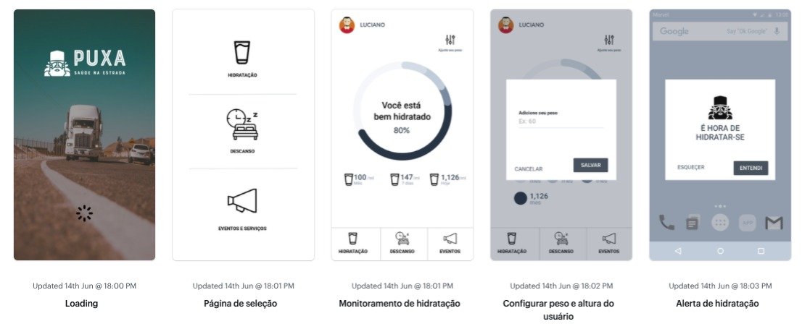
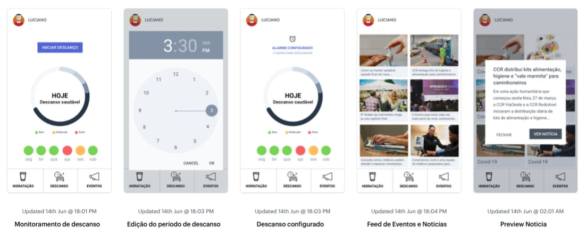

<h3 align="center">
    
      
    <b>Hackaton CCR  -> Solução "Puxa - Saúde na Estrada"</b> 
</h3>

## :bookmark: Sobre
Visando melhorar a saúde e o bem estar do caminhoneiro que roda nas estradas do nosso país, desenvolvemos o app <strong>PUXA</strong>
O app <strong>PUXA</strong> é uma aplicação Mobile que serve para ajudar os caminhoneiros a descansarem mais e com intervalos de tempo regulares, além de enviar alertas para que nossos amigos da estrada se hidratem e melhor; e não menos importante, um feed com eventos que podem occorer nas estradas, tais como: Atendimento médico, distribuição de brindes para almoço, entre outros.

## O projeto

Faz parte da nossa solução trazer comodidade e atenção ao caminhoneiro, que muitas vezes, por conta da correria, não se hidrata de maneira correta e nem consegue descansar em intervalos de tempos regulares, o que afeta diretamente sua saúde. 
Com a concessionária CCR disponibiliza pontos de auxílio de saúde ao caminhoneiro, como é caso do programa Saúde na Estrada, além de implementarmos notificações e controle sobre consumo regular de água e descanso, ainda criamos uma forma de ligar a concessionária CCR ao caminhoneiro. Ela pode realizar eventos em determinados pontos das rodovias e avisar os caminhoneiros, via notificações sobre esses eventos.

## 🚀 Tecnologias usadas

Este projeto foi desenvolvido com as seguintes tecnologias:
- [JavaScript](https://developer.mozilla.org/pt-BR/docs/Aprender/JavaScript)
- [TypeScript](https://www.typescriptlang.org/)
- [Node.js](https://nodejs.org/en/)
- [React Native](https://reactnative.dev/)

## :fire: Como usar

<h3 align="center">
    
</h3>

O app é bem simples e não solicita cadastro do caminhoneiro, porém o mesmo se desejar pode efetuar esse cadastro, pois disponibilizamos um formulário pós-acesso. Ao Acessar o usuário tem, muito simples sob seu alcance, uma tela com três botões que referenciam as páginas e as funcionalidades da aplicação.

O primeiro botão: 'Hidratação' , abre um painel de controle de consumo de água, a partir do peso do usuário, o app calcula e faz a distribuição de alarmes para o consumo correto do nível de água para uma pessoal saudável. 

<h3 align="center">
    
</h3>

Voltando para tela inicial no botão: 'Descanso', o usuário pode clicar no botão e iniciar seu descanso, nosso calcula e informa quanto tempo o usuário descansou e dormiu, bem como informa via gráfico o tempo de descanso , se foi ou está sendo (ou não) suficiente.
Por último temos a tela de eventos. A concessionária pode cadastrar seus eventos e informações importantes para que o usuário saiba sobre notícias e eventos nas estradas. O usuário recebe notificações quando está próximo à eventos para que possa cuidar de sua saúde e bem-estar, bem como receber orientações necessárias.

<h3 align="center">
    
</h3>

## Pitch do Projeto

- [Puxa - Saúde da estrada]("https://www.youtube.com/watch?v=05NilaQ_Wk0")

## :recycle: Como contribuir

- Faça um Fork desse repositório,
- Crie uma branch com a sua feature: `git checkout -b my-feature`
- Commit suas mudanças: `git commit -m 'feat: My new feature'`
- Push a sua branch: `git push origin my-feature`

## :mortar_board: Quem participou?

Nicola Liberato Miranda - Business- infra em TI -  **[Nicola Liberato Miranda](https://github.com/nicolaabre)**

Luciano Tag. Sato - MARKETING - Youtuber | Blockchain | Criptomoedas Usabilidade -  **[Luciano Tag. Sato](https://github.com/sato888)**

Yeremi Loli - ENGENHARIA/DESENVOLVIMENTO - Programador -  **[Yeremi Loli](https://github.com/yeremi)**

Pedro Lima - ENGENHARIA/DESENVOLVIMENTO - Dev Full-Stack Júnior -  **[Pedro Lima](https://github.com/lima-pedro)**

Marcos Roberto - Analisa em telecomunicações -  **[Marcos Roberto](https://github.com/marcosanaka)**

Cândido finda - Análise de Sistemas -  **[Cândido finda](https://github.com/marcosanaka)**

## :memo: License

Esse projeto está sob a licença MIT. Veja o arquivo [LICENSE](LICENSE.md) para mais detalhes.

---

<h4 align="center">
    Readme criado por <a href="https://www.linkedin.com/in/pedro-lima-832514195/" target="_blank">Pedro Lima</a>
</h4>